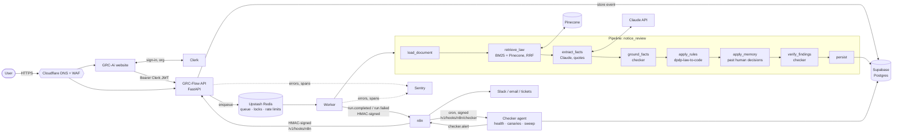
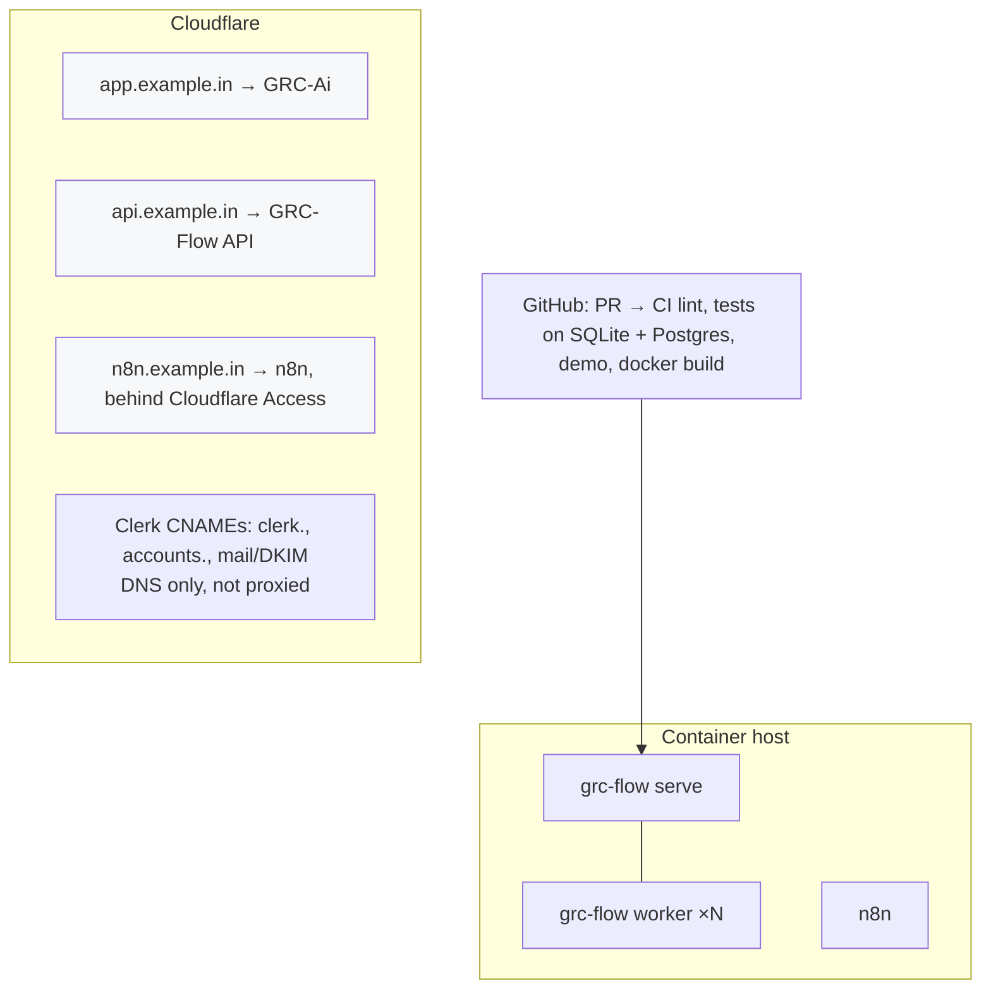

# GRC-Flow: system design (prototype v0.1)

GRC-Flow is the **backend AI pipeline** behind the [GRC-Ai](https://github.com/Harshitahusts/GRC-Ai)
website. The website is where people work. GRC-Flow is the internal agent that watches what changes,
reads documents, decides compliance with deterministic rules, and has a **checker agent** verify
every step and every flow. n8n handles automations in and out.

The first automated pipeline is **privacy-notice review** (DPDP Act Section 5). Other events
(vendor added, evidence expiring, data flow changed) are already accepted, stored and routed to
n8n, ready for their own pipelines.

## 1. The stack and where each piece sits

| Need | Service | What it does here | Local stand-in (no keys) |
|---|---|---|---|
| Website | **GRC-Ai** (FastAPI app) | UI for engagements, registers, evidence, analyst chat. Sends events, shows runs and findings | — |
| Auth | **Clerk** | Sign-in, organisations, roles. The API verifies Clerk session JWTs (RS256 via JWKS, `iss`, `azp`, expiry) and scopes every query to the Clerk `org_id` | `GRC_FLOW_AUTH=dev` (refused in production) |
| Database | **Supabase** (Postgres) | Events, runs, steps, findings, human decisions (agent memory), checker results. Reached through GRC-Ai's own Postgres layer | SQLite file |
| Vector DB | **Pinecone** | DPDPA corpus with *integrated embedding* (`multilingual-e5-large` on `chunk_text`), so there's no separate embedding provider | In-memory TF-IDF index |
| Queue, locks, cache, rate limits | **Upstash Redis** (REST) | Event queue, dead-letter list, per-event processing lock, per-org rate limit | In-process |
| LLM | **Claude** (`claude-opus-5-5`) | Reads a notice and reports *facts with verbatim quotes*. Never decides compliance | Keyword extractor (`GRC_FLOW_AI_MODE=offline`) |
| Rules | **dpdp-law-to-code** (MIT) | Decides compliance from the facts, with a statutory citation | — |
| Automation | **n8n** | Schedules the checker, routes alerts (Slack etc.), forwards events from other tools. All traffic is HMAC-signed both ways | Disabled |
| Errors / performance | **Sentry** | Exceptions with run/step tags, one span per pipeline step. PII scrubbed (`send_default_pii=False`, no request bodies or auth headers) | Log only |
| DNS / edge | **Cloudflare** | DNS for `app.`, `api.`, `n8n.`, and Clerk's records. WAF and rate limiting in front of the API. Cloudflare Access in front of n8n | — |
| Source control / CI | **GitHub** | This repo and GRC-Ai. CI runs lint, tests on SQLite *and* Postgres, the offline end-to-end demo, and a Docker build | — |

## 2. Architecture



## 3. One event, end to end

```mermaid
sequenceDiagram
  actor U as Consultant
  participant W as GRC-Ai website
  participant A as GRC-Flow API
  participant D as Supabase
  participant Q as Upstash
  participant K as Worker
  participant P as Pinecone
  participant C as Claude
  participant N as n8n
  U->>W: uploads / edits the client's privacy notice
  W->>A: POST /v1/events (Clerk JWT) {document.uploaded, subject, text, facts}
  A->>A: verify JWT, org_id, rate limit 60/min/org
  A->>D: insert event (idempotency key → duplicates return 200, not queued)
  A->>Q: LPUSH event id
  A-->>W: 202 {event_id}
  K->>Q: RPOP, then SET NX lock (no double processing)
  K->>P: retrieve provisions (+ BM25 over the same corpus)
  K->>C: notice + provisions → facts with verbatim quotes (structured JSON)
  K->>K: checker: every "yes" quote must be in the notice, else → unknown
  K->>K: rules decide per check; unknown/low-confidence → needs_human_review
  K->>D: past decisions: same facts → suppressed; changed facts → resurfaced
  K->>K: checker: citations resolve, no decision on unknown facts, all steps ran
  K->>D: findings + run status + every step (timings, no document text)
  K->>N: run.completed (signed)
  N->>N: verify signature; gaps or failures → Slack
  W->>A: GET /v1/runs/{id} → steps and findings with citations
  U->>A: POST /v1/decisions (accept risk + reason) → agent memory
```

## 4. The checker agent

The checker makes sure the flows work. It **fails closed**: anything it can't verify becomes
`needs_human_review`.

| Level | When | What it checks | On failure |
|---|---|---|---|
| **Per run** | Every pipeline run | Quotes are verbatim in the document (whitespace and curly-quote tolerant). Citations resolve in the ingested corpus. No `compliant`/`gap` on an unknown fact. All 8 steps ran and reported ok | Fact → `unknown`, finding → `needs_human_review`, run → `needs_human_review` |
| **Health** | n8n every 15 min, `GET /health/deep`, `grc-flow check` | Database, queue depth, corpus loaded, Pinecone record count and corpus version match, LLM configured, n8n/Sentry/Clerk configured (required in production) | `checker.alert` to n8n, Sentry error |
| **Canaries** | n8n daily, `grc-flow canary` | Two fictional notices with known answers go through the *real* pipeline. Any status differing from expected is a regression | `checker.alert`, Sentry |
| **Sweep** | Worker every 5 min, n8n every 10 min | Runs left `running` > 15 min (crashed worker) are marked `abandoned` and re-queued | Re-queue, Sentry warning |

Every check result is stored in `flow_checks`, so the history of "was the system healthy" is auditable.

## 5. Data model (Supabase)

```mermaid
erDiagram
  flow_events ||--o{ flow_runs : "processed by"
  flow_runs ||--o{ flow_steps : "records"
  flow_runs ||--o{ flow_findings : "produces"
  flow_decisions }o..o{ flow_findings : "matches on org+subject+check+fact_hash"
  flow_events { text id PK; text type; text org_id; text source; text idempotency_key UK; text payload_json; text received_at }
  flow_runs { text id PK; text event_id FK; text pipeline; text status; text checker_json; text error }
  flow_steps { int id PK; text run_id FK; int seq; text name; text status; int ms; text detail_json }
  flow_findings { text id PK; text run_id FK; text org_id; text subject; text check_name; text status; text citations_json; text facts_json; text fact_hash; text memory_json }
  flow_decisions { text id PK; text org_id; text subject; text check_name; text decision; text reason; text decided_by; text fact_hash; text expires_at }
  flow_checks { int id PK; text kind; text target; int ok; text detail_json }
```

`flow_` tables can share the Supabase project with GRC-Ai's own tables, since GRC-Ai already supports
`GRC_DATABASE_URL`. **Memory rule:** a human decision applies only while the facts it was made on
(`fact_hash`) are unchanged and it hasn't expired. Rewording without a change in substance doesn't
resurface it; a real change does.

## 6. Security and privacy

- **Auth:** Clerk JWTs verified locally (JWKS cached 1 h). `azp` must be one of our origins. Every
  read is scoped to the token's organisation (another org's run id returns 404). Admin-only: deep
  health, canaries, checker history.
- **Service calls:** n8n ↔ API signed with HMAC-SHA256 over `timestamp.body`, with a 5-minute
  replay window. Verified byte-for-byte between the Python signer and n8n's JavaScript.
- **Production guard:** `GRC_FLOW_ENV=production` refuses to start without Supabase, Pinecone,
  Upstash, Sentry, Clerk and the n8n secret, or with dev auth or the offline extractor.
- **PII:** step logs store counts, hashes and citations, never document text. Sentry gets no request
  bodies or auth headers. Notice text goes to Claude (use an API tier with no training on inputs, and
  a DPA, as the DPDPA itself requires).
- **Abuse:** per-org rate limit in Upstash, plus Cloudflare WAF and rate rules on `api.`.

## 7. Deployment



- One Docker image for both API and worker (`docker-compose.yml` also runs n8n locally).
- Workers are long-running, so they need a container host (e.g. Fly.io, Render, Railway, a VM or
  Kubernetes), not a serverless platform. **Which host is a decision for you.**
- Run `grc-flow rag-init` (or `docker compose --profile init run --rm rag-init`) once, and again
  whenever the corpus changes. It ingests the gazette PDFs in `corpus/` (GRC-Ai format), refuses a
  corpus with numbering gaps, creates the Pinecone index if needed, and upserts one record per provision.

## 8. Connecting the GRC-Ai website

These are changes for a PR on the GRC-Ai repo. This session has read-only access to it.

1. **Clerk sign-in** replaces the local login. GRC-Ai forwards the Clerk session token as
   `Authorization: Bearer` to GRC-Flow, and maps Clerk organisations to its clients.
2. **Send events:** when a policy or notice is uploaded or edited (it already extracts text with
   pypdf), `POST /v1/events` with
   `{"type": "document.uploaded", "payload": {"doc_type": "privacy_notice", "subject": "<document id>", "text": "...", "facts": {"is_given_before_or_with_consent_request": "yes"}}}`.
   The process fact comes from the engagement intake.
3. **Show results:** a "Runs" panel from `GET /v1/runs` and `/v1/runs/{id}` (steps, findings,
   citations, checker verdict). "Accept risk" and "Dismiss" call `POST /v1/decisions` with the finding's `fact_hash`.
4. **Share the corpus and the database:** both apps read the same `corpus/` and can share one
   Supabase project.

## 9. Status of this prototype

| Area | State |
|---|---|
| Pipeline, rules, checker, memory, API, CLI | Built. 42 tests pass on SQLite and on PostgreSQL 16 |
| Offline end to end | `grc-flow demo` and a real server + worker over HTTP, all health checks green |
| n8n | 3 importable workflows. Signature code verified under Node against real backend output |
| Claude extraction | Built on GRC-Ai's call pattern. **Tested with a fake client only** (no API key in this environment) |
| Pinecone, Upstash, Clerk, Sentry | Adapters written against each SDK's installed source. **Not yet run against live accounts** (their docs and APIs were unreachable from this environment). First step with real keys: `grc-flow rag-init`, then `grc-flow check` and `grc-flow canary` |
| Docker | Compose file validated. Image build runs in CI (no Docker daemon here) |
| Pipelines beyond notices | Events accepted, stored and routed to n8n (`triage`). Consent, breach and vendor pipelines are next |
| Legal content | Uses a **fictional** fixture corpus for tests. Production needs the official gazette PDFs in `corpus/`. Rule outputs need legal review |
